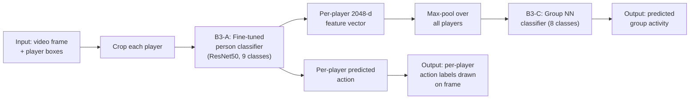

# Volleyball Group Activity Recognition — Baseline B3

Implementation and results for **Baseline 3 (B3)**: fine-tuned person-action classification followed by max-pooled group-activity classification, on the [Volleyball Dataset](https://www.kaggle.com/datasets/ahmedmohamed365/volleyball) (Ibrahim et al., CVPR 2016 / arXiv:1607.02643 — *A Hierarchical Deep Temporal Model for Group Activity Recognition*).

---

## 1. Dataset

- 55 volleyball videos, 4830 annotated clips (3493 train / 1337 test), each clip = 41 frames, only the middle frame is annotated.
- **9 person action labels**: waiting, setting, digging, falling, spiking, blocking, jumping, moving, standing.
- **8 group activity labels**: right set, right spike, right pass, right winpoint, left winpoint, left pass, left spike, left set.
- Each annotation line: `{frame filename} {group activity} {action x y w h} {action x y w h} ...` — one `(x, y, w, h, action)` group per visible player.
- Loaded via `track_crop(ann)` → per-clip list of `(cropped_player_image, player_action_label)` pairs + the clip's `group_label`; wrapped in a custom PyTorch `Dataset` (`volleyball`) that stacks all player crops of a clip into one batch item.

## 2. Method — Baseline B3

Three stages, following the baseline definitions from the original paper:

**A) Person-action fine-tuning**
Fine-tune a CNN image classifier (ResNet50-based) on cropped single-player images to predict one of the 9 action classes.

**B) Feature extraction per clip**
For every clip in the test set:
1. Crop every visible player from the middle frame.
2. Run each crop through the fine-tuned classifier; take the penultimate-layer output as a 2048-d feature vector per player.
3. **Max-pool** the per-player 2048-d vectors → a single 2048-d clip-level representation.

**C) Group-activity classification**
Train a small NN classifier on the pooled 2048-d clip representations to predict one of the 8 group activity classes.

This mirrors baseline **"B3 – Fine-tuned Person Classification"** in Ibrahim et al.: person-level fine-tuning is done independently of the group-level task, and group activity is inferred purely by pooling — **no temporal modeling (no LSTM), no explicit spatial/team structure.**

## 3. Results

| Stage | Task | Metric | Value |
|---|---|---|---|
| B3-A | Person action classification (9 classes) | Test accuracy | **80.6%** |
| B3-C | Group activity classification (8 classes), max-pooled over players | Test accuracy | **72%** |
| B1 (earlier baseline, for reference) | Whole-image classification (8 classes), no person modeling | Val accuracy | 54.4% (best run 57.2%) |

## 4. Comparison against the original paper's baselines

The original paper (Ibrahim et al.) reports the following baseline table on this exact dataset (55 videos, 8 group-activity classes) — **every row below is group-activity accuracy**, including the B1–B7 baselines:

| Method | Accuracy |
|---|---|
| B1-Image Classification | 66.7 |
| B2-Person Classification | 64.6 |
| **B3-Fine-tuned Person Classification** | **68.1** |
| B4-Temporal Model with Image Features | 63.1 |
| B5-Temporal Model with Person Features | 67.6 |
| B6-Two-stage Model without LSTM 1 | 74.7 |
| B7-Two-stage Model without LSTM 2 | 80.2 |
| Our Two-stage Hierarchical Model | 81.9 |

**Important distinction:** all of the numbers above measure the same task — group-activity classification (8 classes). The paper does not separately report person-level action-classification accuracy (9 classes) in this table, so our person-level 80.6% is not directly comparable to any single row here — it's a different task from a different (earlier) stage of the pipeline.

**The valid, apples-to-apples comparison** is between our group-activity result and the paper's **B3** row, since B3 uses the exact same design we implemented (fine-tune a person-action classifier → max-pool per-clip features → train a classifier on the pooled features, with no temporal/LSTM modeling):

| | B3 group-activity accuracy |
|---|---|
| Paper (Ibrahim et al.) | 68.1% |
| **Ours** | **72%** |

Our B3 implementation beats the paper's B3 baseline by **+3.9 points**, on the identical baseline design and dataset. That's a legitimate, citable result.

It still sits, as expected, below the paper's full two-stage hierarchical model (81.9%), which adds two LSTM stages (person-level temporal + group-level temporal) that B3 deliberately omits — the gap is attributable to that added temporal modeling, not to a weaker implementation of B3 itself.

**A note on the person-level 80.6% number:** every row in the table above — B1 through the final Two-stage Hierarchical Model — measures **group-activity accuracy (8 classes)**, including B2 (64.6%) and the final model (81.9%). None of them measure person-level action-classification accuracy (9 classes), which is a different task performed at an earlier, intermediate stage of the B3 pipeline (stage A). The paper does not report a person-action-classification accuracy number anywhere in this table, so **80.6% has no corresponding row to be compared against** — it should be reported as our own intermediate result, not benchmarked against any paper number.

## 5. Tools & Stack

- **Python** — primary language
- **PyTorch** — model definition, training, and inference (`torch.utils.data.Dataset` / `DataLoader`, `torchvision.models.resnet50` as the backbone)
- **OpenCV (`cv2`)** — reading frames, drawing boxes/labels, writing the prediction video
- **Pillow (`PIL`)** — cropping player images from frames during data loading
- **NumPy** — feature pooling (max-pool over per-player vectors)
- **Weights & Biases (`wandb`)** — experiment tracking for training runs
- **Google Colab / Kaggle** — training and experimentation environment
- **PyCharm** — local development

## 6. Pipeline Overview



**Flow in words:** a frame's player boxes are cropped → each crop goes through the fine-tuned person classifier, giving both a per-player action prediction and a 2048-d feature vector → all players' feature vectors are max-pooled into one clip-level vector → that vector is classified by the group NN → the final outputs are (1) a per-player action label on each box and (2) one group-activity label for the whole image.

## 7. Repo structure (suggested)

```
.
├── data/
│   └── volleyball_annot_loader.py   # track_crop, track_data, track_boxes, track_meta_data
├── datasets/
│   └── volleyball_dataset.py        # `volleyball` PyTorch Dataset class
├── models/
│   ├── person_classifier.py         # B3-A: fine-tuned ResNet50, 9-class head
│   └── group_classifier.py          # B3-C: NN over pooled 2048-d features, 8-class head
├── train_person_classifier.py
├── train_group_classifier.py
├── render_predictions_video.py      # per-player + whole-image prediction video
└── README.md
```

## 8. Citation

```
@inproceedings{ibrahim2016hierarchical,
  title     = {A Hierarchical Deep Temporal Model for Group Activity Recognition},
  author    = {Ibrahim, Mostafa S. and Muralidharan, Srikanth and Deng, Zhiwei and Vahdat, Arash and Mori, Greg},
  booktitle = {CVPR},
  year      = {2016}
}
```
